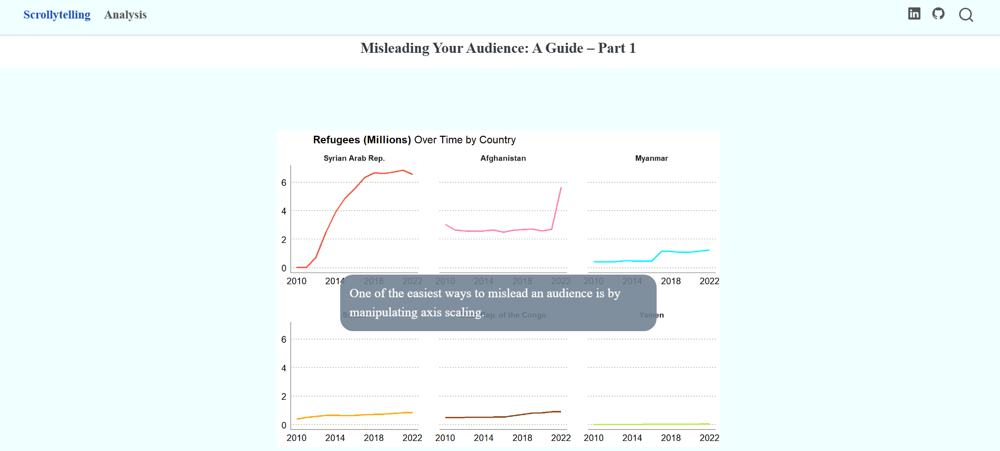

## Sydney Beach Water Monitor

**Shiny** web application built in **R** that enables users to assess **Enterococci contamination** risk at Sydney swim sites.  

Designed for public accessibility, the layout ensures clear interpretation of risk indicators.  

Currently, the dataset includes entries up to April 2025. This app has the potential to be dynamic—if data is sourced from an updated file or database, it will automatically load the newest dataset upon restart, ensuring real-time accuracy.  

Beyond pathogen monitoring, this framework can be adapted for **real-time decision-making in public health**, including climate change, environmental hazards, and epidemic intelligence. 

### Packages Used:
- **tidyverse**:	Data wrangling and transformation
- **leaflet**:	Interactive map rendering
- **leaflet.extras**:	Search bar and additional map features
- **shiny**:	Web application framework
- **shinyBS**:	Bootstrap components for enhanced UI
- **shinythemes**:	Predefined themes for polished layout
- **rsconnect**:	Deployment to shinyapps.io

**View the live app**: [**Sydney Beach Water Monitor App**](https://adm2ru-darakhshan-nehal.shinyapps.io/bw-tracker/) | **Deployment**: shinyapps.io

**Data**: **#TidyTuesday** (2025-05-20) |  [Water Quality at Sydney Beaches](https://github.com/rfordatascience/tidytuesday/blob/main/data/2025/2025-05-20/readme.md)
